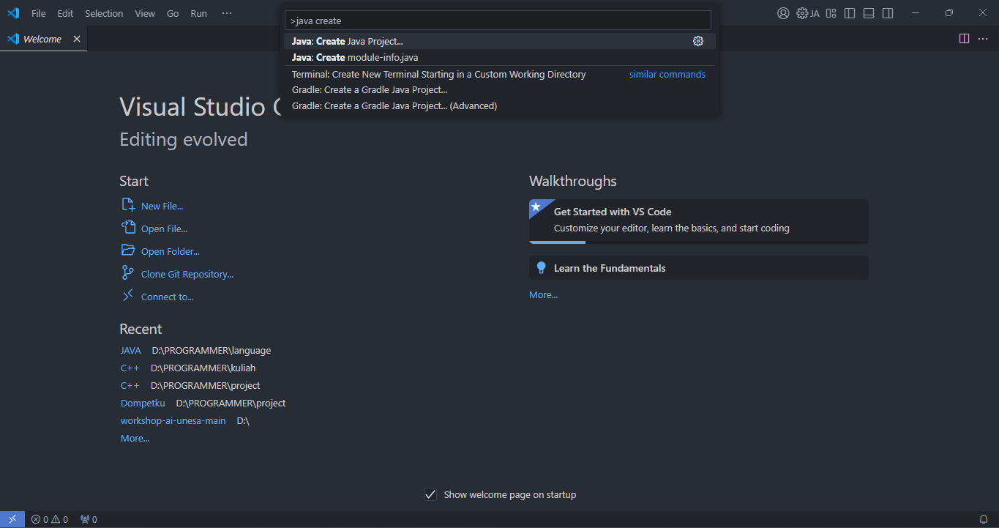
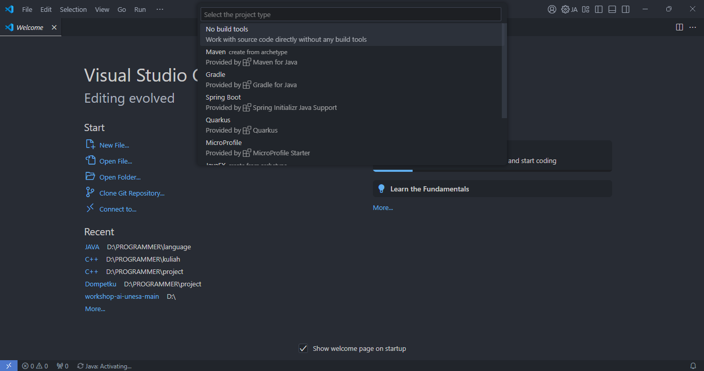
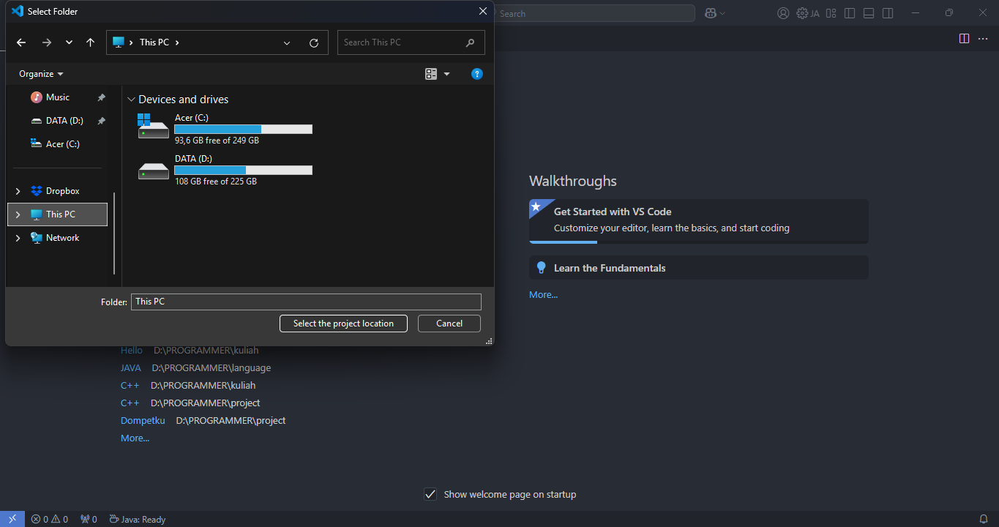
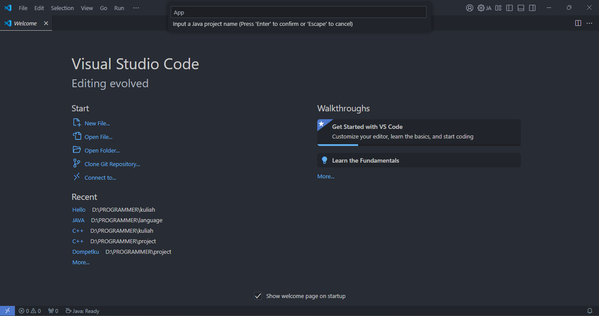

# 📚 Hasil Pembelajaran Java

Repository ini berisi hasil belajar saya tentang pemrograman Java selama kuliah.

## ⚙️ Setup Sebelum Menjalankan Java

### 1. Install JDK

1. **Unduh JDK**
    - Kunjungi situs resmi [Oracle JDK](https://www.oracle.com/java/technologies/downloads/) atau gunakan [Open JDK](https://jdk.java.net/).
    - Pilih versi JDK sesuai kebutuhan, disarankan minimal JDK 17 (LTS).
  
2. **Install JDK**
   - Ekstrak file archive ke direktori pilihan.

### 2. Set Environment Variable (Path)

Sebelum memastikan JDK dapat di gunakan di mana saja pastikan untuk mengingat dimana file direktori JDK di simpan

**Windows:**

1. Buka System Properties > Environment Variables > System Variables
   
2. Tambahkan path JDK ke dalam Path:
    ```bash
    C:\Program Files\java\jdk-23.0.1\bin
    
3. Simpan dan restart terminal
   
4. Buka terminal/command prompt dan ketik:
    ```bash
    java -version
    javac -version

5. Output yang di harapkan:
    ```bash
    openjdk version "23.0.1" 2024-10-15
    OpenJDK Runtime Environment (build 23.0.1+11-39)
    OpenJDK 64-Bit Server VM (build 23.0.1+11-39, mixed mode, sharing)
    javac 23.0.1

### 3. Install Editor/IDE untuk java

Gunakan salah satu editor berikut:

- **Visual Studio Code:** [Download Visual Studio code](https://code.visualstudio.com/)
    - Tambahkan extension Java Extension Pack
- **Intellij IDEA:** [Download Intellij IDEA](https://www.jetbrains.com/idea/)
- **NetBeans:** [Download NetBeans](https://netbeans.apache.org/front/main/index.html)

### 4. Buat Project

**Visual Studio Code:**

1.  Buka Visual Studio Code

2.  Tekan command ctrl > shift > p untuk membuka command pallete

3.  Cari Java create program
    

4.  Pilih No build tools
    

5.  Tentukan path project di simpan
    

6.  Masukkan nama project
    

### 5. Struktur Folder

1.  Setelah membuat project baru anda akan mendapatkan  struktur folder seperti berikut

    ```bash
    .
    └── App/
        ├── .vscode/
        │   └── setting.json
        ├── lib
        ├── src/
        │   └── App.java
        └── README.md

2.  Tambahkan folder bin sehingga menjadi:

    ```bash
    .
    └── App/
        ├── .vscode/
        │   └── setting.json
        ├── bin
        ├── lib
        ├── src/
        │   └── App.java
        └── README.md

**Penjelasan Folder:**

1.  .vscode => Di gunakan untuk mengedit pengaturan dari visual studio code dalam project yang sedang di kerjakan.

2.  bin => Di gunakan untuk menyimpan hasil dari meng compile file.

3.  lib => Di gunakan untuk menyimpan library dari project.

4.  src => Di gunakan untuk menyimpan source code dari project.

### 6. Menjalankan Program java

**Visual Studio code:**

1. Buka terminal/command prompt.
   
2. Navigasikan ke direktori project anda.
   ```bash
   D:\PROGRAMMER\language\JAVA\App
   
3. Compile program java:
    ```bash
    javac -d bin src/App.java
    
4. Jalankan program java:
    ```bash
    java -cp bin src.App

## 🧩 Catatan Tambahan
Jika Anda mengalami masalah saat setup atau menjalankan program, silakan ajukan pertanyaan melalui Issues di repository ini.